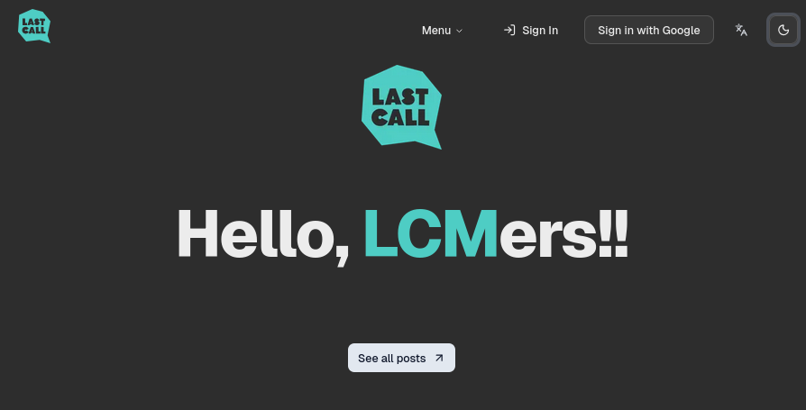

# LCM Next.js Quickstart

A production-ready Next.js boilerplate project for Last Call Media, designed to accelerate project development with modern best practices and a comprehensive tech stack.


[](https://nodejs.org/)
[](https://nextjs.org/)
[](https://www.typescriptlang.org/)
[](LICENSE)



## 🚀 Get Started

### Prerequisites

- [**Node.js**](https://nodejs.org/): v22.0 
- [**pnpm**](https://pnpm.io/installation): v8.0.0 or higher
- [**Docker**](https://docs.docker.com/desktop/setup/install/windows-install/): For database and development services

### Installation

1. **Clone and install dependencies**:

   ```bash
   git clone https://github.com/LastCallMedia/lcm-nextjs-boilerplate.git

   cd lcm-nextjs-boilerplate

   pnpm install
   ```

2. **Set up environment variables**:

   ```bash
   cp .env.example .env
   # Edit .env with your configuration
   ```

3. **Setup the database**:

   ```bash
   pnpm docker:dev

   pnpm db:generate
   ```

4. **Start development server**:
   ```bash
   pnpm dev
   ```

Visit [http://localhost:3000](http://localhost:3000) to see your application.


## ✨ What is Quickstart?

This project aims to reduce painpoints when creating a new web project by incorporating features and tech stacks necessary to makea modern web project with Next.js that meets LCM's rigorous standards. 

Ideally this will provide all the requirements, libraries, and features needed to create a working project with everything pre-configured for you so things work out-of-the-box.

### Included Core Features

- **🚀 [T3 Stack](https://create.t3.gg/)**: Next.js, tRPC, Prisma, Tailwind CSS, NextAuth.js, Zod
- **⚛️ React 19**: Latest React features with concurrent rendering
- **🔒 Authentication**: Complete NextAuth.js setup with Google provider
- **🗄️ Database**: PostgreSQL with Prisma ORM and type-safe queries
- **🎨 UI Components**: [shadcn/ui](https://ui.shadcn.com/) with Radix UI primitives
- **🌙 Dark Mode**: Built-in theme switching with next-themes

### Easing Developer Experience

- **📝 TypeScript**: Fully typed with strict configuration
- **🔧 ESLint & Prettier**: Code formatting and linting
- **🧪 Testing**: Jest for unit tests, Playwright for E2E testing
- **♿ Accessibility**: Built-in accessibility testing with axe-core
- **🐳 Docker**: Complete containerization setup
- **📱 Responsive**: Mobile-first design approach

### Simplifying Production Deployment

- **🔐 Environment Validation**: Type-safe environment variables with @t3-oss/env-nextjs
- **🚀 Performance**: Optimized builds with standalone output
- **📊 Monitoring**: Ready for production monitoring integration
- **🔄 CI/CD Ready**: GitHub Actions compatible structure

## 📚 Documentation

We also provide comprehensive documentation pages available in the [`docs/`](./docs/) directory:

### Key feature development
- **[🛠️ Setup & Installation](./docs/setup.md)** - Detailed setup instructions
- **[🏗️ Architecture](./docs/architecture.md)** - Project structure and design decisions
- **[🔑 Authentication](./docs/authentication.md)** - NextAuth.js configuration and usage
- **[🗄️ Database](./docs/database.md)** - Prisma setup, migrations, and best practices
- **[🗺️ Layout](./docs/project-layout.md)** - Information on where everything is stored in this project

### Testing and best practice guides
- **[🎨 UI & Styling](./docs/ui-styling.md)** - Component library and styling guide
- **[🧪 Testing](./docs/testing.md)** - Testing strategies and tools
- **[🔄 Cypress to Playwright Migration](./tests/cypress/README.md)** - Guide for migrating from Cypress to Playwright
- **[🎭 Local GitHub Actions Testing](./docs/local-github-action-testing.md)** - Run GitHub Actions locally with act

### Deployment information
- **[🐳 Docker](./docs/docker.md)** - Containerization and deployment
- **[🔧 Development](./docs/development.md)** - Development workflow and tools
- **[🚀 Deployment](./docs/deployment.md)** - Production deployment guide

### 🤖 AI Development 

- **[📝 Copilot Instructions](./.github/copilot-instructions.md)** - Template for configuring Copilot with project-specific context and guidelines
- **[🔎 Custom Instructions](./.github/instructions/markdown.instructions.md)** - Example for writing custom markdown instructions with Copilot

### Additional Resources

- [🔼 Next.js Documentation](https://nextjs.org/docs)
- [3️⃣ T3 Stack Documentation](https://create.t3.gg/)
- [💎 Prisma Documentation](https://www.prisma.io/docs)
- [🤝 tRPC Documentation](https://trpc.io/docs)
- [🌬️ Tailwind CSS Documentation](https://tailwindcss.com/docs)

## 🤝 Contributing

We welcome contributions! Please see our [Contributing Guide](./docs/contributing.md) for details.

1. Fork the repository
2. Create a feature branch
3. Make your changes
4. Add tests if applicable
5. Submit a pull request

## 📋 Project Management

This project is tracked in our [WKSP Jira Board](https://lastcall.atlassian.net/jira/software/projects/WKSP/boards/203/backlog).

## 📄 License

This project is licensed under the MIT License - see the [LICENSE](LICENSE) file for details.

## 🏢 About Last Call Media

This project is maintained by [Last Call Media](https://lastcallmedia.com), a digital agency specializing in open-source web development.

---

**Made with ❤️ by the LCM Team**