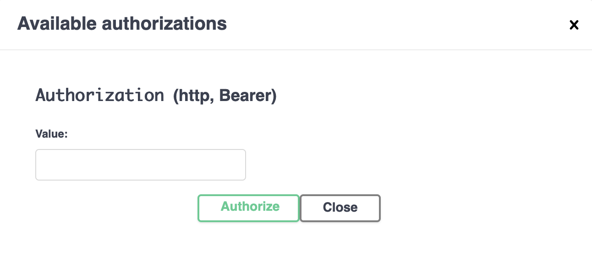

# API Documentation

This API is built with tRPC and automatically generates OpenAPI documentation for REST API compatibility.

## � Authentication

### Get Session Token from Browser



1. Sign in to your application through the normal login flow (Google OAuth)
2. Open browser developer tools (F12)
3. Go to **Application/Storage** tab → **Cookies** → Your domain
4. Find the cookie named `next-auth.session-token` or `__Secure-next-auth.session-token`
5. Copy the value of that cookie - this is your Bearer token

### Using the API

Use the session token as a Bearer token in the Authorization header:

```
Authorization: Bearer <your-session-token>
```

## 🚀 Quick Start

### Available Endpoints

- **OpenAPI Schema**: `/api/openapi.json` - Complete API documentation
- **Example Endpoints**:
  - `GET /api/posts/hello?name=World` - Get a personalized greeting (public)
  - `GET /api/posts` - Get all posts (public)
  - `POST /api/posts` - Create a new post (protected)
  - `GET /api/posts/latest` - Get the latest post (protected)

## �️ Adding New Routers

When you add new tRPC routers, follow these steps:

### 1. Create Router with OpenAPI Metadata

```typescript
export const userRouter = createTRPCRouter({
  getProfile: protectedProcedure
    .meta({
      openapi: {
        method: "GET",
        path: "/users/profile",
        tags: ["users"],
        summary: "Get user profile",
        protect: true, // for protected procedures
      },
    })
    .input(z.void())
    .output(UserSchema)
    .query(async ({ ctx }) => {
      // Your implementation
    }),
});
```

### 2. Add to Root Router

Update `src/server/api/root.ts`:

```typescript
export const appRouter = createTRPCRouter({
  post: postRouter,
  user: userRouter, // Add your new router
});
```

### 3. Update OpenAPI Document

Update `src/server/api/openapi.ts`:

```typescript
export const openApiDocument = generateOpenApiDocument(appRouter, {
  title: "LCM Boilerplate API",
  description: "OpenAPI compliant REST API built with tRPC",
  version: "1.0.0",
  baseUrl: "http://localhost:3000/api",
  docsUrl: "https://github.com/mcampa/trpc-to-openapi",
  tags: ["posts", "users"], // Add your tags
});
```

## 🔧 Why Each Component is Needed

### Required Setup Components

1. **`/api/openapi.json/route.ts`** - Serves the OpenAPI schema document
2. **`trpc.ts` with OpenAPI meta** - Enables OpenAPI metadata on procedures
3. **`openapi.ts` with openApiDocument** - Generates the complete API schema
4. **Router procedures** - Need `.meta()`, `.input()`, `.output()` for OpenAPI generation

### Required Fields for Each Procedure

For OpenAPI generation, each procedure needs:

- **`.meta()`** - OpenAPI configuration (method, path, tags, summary, protect)
- **`.input()`** - Zod schema (use `z.void()` if no input)
- **`.output()`** - Zod schema for response
- **`protect: true/false`** - Security requirement in metadata

### Public vs Protected Procedures

- **`publicProcedure`** - No authentication required (`protect: false`)
- **`protectedProcedure`** - Requires authentication (`protect: true`)

## 🧪 Testing Your API

1. **Get your session token** (see instructions above)
2. **Test with curl**:

   ```bash
   # Public endpoint
   curl http://localhost:3000/api/posts/hello?name=World

   # Protected endpoint
   curl -H "Authorization: Bearer <your-token>" http://localhost:3000/api/posts/latest
   ```

3. **Use the OpenAPI schema** in tools like Postman or Insomnia
